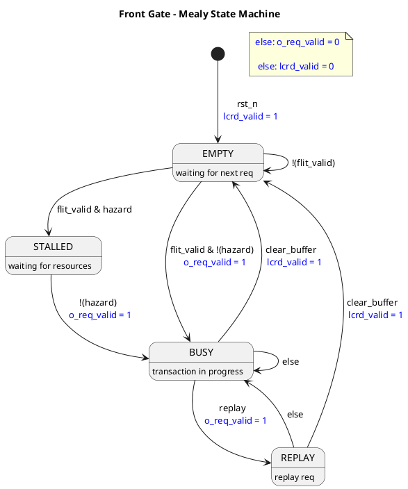
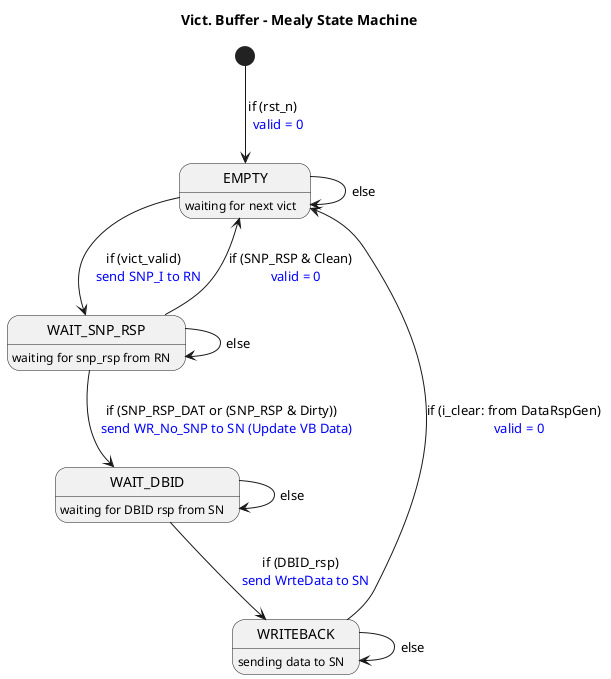

#Minimum Viable Product Design

## Front Gate (llc_req_buffer_gate)

####Assertions:
-  No new request (flit_valid) when not in EMPTY state
-  "clear_buffer" and "replay" signals should not be set in the same cycle. 

## Victim Buffer (llc_vict_buffer)

