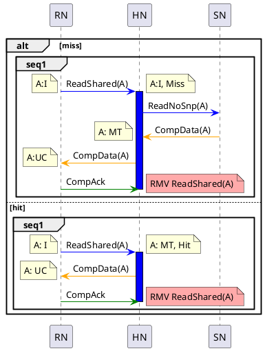
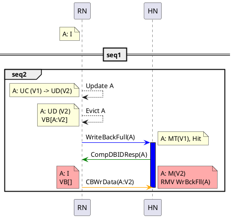
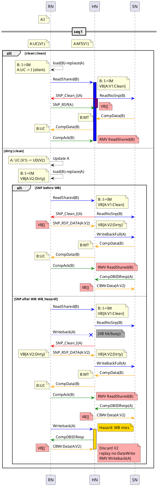

#V0.1-MVP Verification 

## Test Transactions

### Test1: Simple Load miss/hit

```plantuml 
@startuml 
alt miss
    group seq1
        RN -[#blue]> HN: ReadShared(A) 
        activate HN #0000ff
        note left : A:I
        note right : A:I, Miss
        HN -[#blue]> SN : ReadNoSnp(A)
        SN -[#orange]> HN : CompData(A)
        note left : A: MT
        HN -[#orange]> RN : CompData(A)
        note left: A:UC
        RN -[#green]> HN : CompAck
        note right #FFAAAA : RMV ReadShared(A)
        deactivate HN
    end
else hit 
    group seq1
        RN -[#blue]> HN : ReadShared(A)
        activate HN #0000ff
        note left : A: I
        note right : A: MT, Hit
        HN -[#orange]> RN : CompData(A)
        note left : A: UC
        RN -[#green]> HN : CompAck
        note right #FFAAAA : RMV ReadShared(A)
        deactivate HN
    end
end 

@enduml 
```

### Test2: Writeback dirty data to LLC

```plantuml 
@startuml 
note left RN: A: I
== seq1 ==
group seq2
    RN --> RN: Update A
    note left: A: UC (V1) -> UD(V2)
    RN --> RN: Evict A
    note left: A: UD (V2) \n VB[A:V2]
    RN -[#blue]> HN : WriteBackFull(A)
    activate HN #0000ff

    note right : A: MT(V1), Hit
    HN -[#green]> RN : CompDBIDResp(A)
    RN -[#orange]> HN : CBWrData(A:V2)
    note right #FFAAAA: A: M(V2) \nRMV WrBckFll(A)
    note left #FFAAAA: A: I \nVB[]
    deactivate HN
end
@enduml 
```

### Test3: LLC Victim

```plantuml 
@startuml 
!pragma teoz true
note left RN: A:I
== seq1 ==
note left RN: A:UC(V1)
& note left HN: A:MT(V1)

alt clean|clean
    RN --> RN : load(B)-replace(A)
    note left: B: I->IM \nA:UC -> I (silent)
    RN -[#blue]> HN : ReadShared(B)
    activate HN #blue
    note right: B: I->IM \nVB[A:V1:Clean]
    HN -[#blue]> SN : ReadNoSnp(B)  
    activate HN #purple
    & HN -[#red]> RN : SNP_Clean_I(A)
    RN -[#green]> HN : SNP_RSP(A)
    deactivate HN
    note right #FFAAAA: VB[]
    SN -[#orange]> HN : CompData(B)
    note left : B:MT 
    HN -[#orange]> RN : CompData(B)
    note left : B:UC
    RN -[#green]> HN : CompAck(B)
    note right #FFAAAA : RMV ReadShared(B)
    deactivate HN

else dirty|clean
    RN --> RN: Update A
    note left: A: UC (V1) -> UD(V2)
    RN --> RN : load(B)-replace(A)
    note left: B: I->IM \nVB[A:V2:Dirty]
    alt SNP before WB
        RN -[#blue]> HN: ReadShared(B) 
        note right: B: I->IM \nVB[A:V1:Clean]
        HN -[#blue]> SN : ReadNoSnp(B)  
        & HN -[#red]> RN : SNP_Clean_I(A)
        RN -[#orange]> HN : SNP_RSP_DATA(A:V2)
        note left #FFAAAA: VB[]
        note right: VB[A:V2:Dirty]
        HN -[#blue]> SN : WriteBackFull(A)
        SN -[#orange]> HN : CompData(B)
        note left : B:MT 
        HN -[#orange]> RN: CompData(B)
        note left : B:UC
        RN -[#green]> HN : CompAck(B)
        note right #FFAAAA : RMV ReadShared(B)
        SN -[#green]> HN : CompDBIDResp(A)
        HN -[#orange]> SN : CBWrData(A:V2)
        note left #FFAAAA: VB[]

    else SNP after WB: WB_Hazard!
        RN -[#blue]> HN: ReadShared(B) 
        note right: B: I->IM \nVB[A:V1:Clean]
        HN -[#blue]> SN : ReadNoSnp(B) 
        RN --[#blue]>x HN : Writeback(A) 
        note right #darkgray: (VB hit/busy)
        HN -[#red]> RN : SNP_Clean_I(A) 
        RN -[#orange]> HN : SNP_RSP_DATA(A:V2)
        note left: VB[A:V2:Dirty]
        note right: VB[A:V2:Dirty]
        HN -[#blue]> SN : WriteBackFull(A)
        SN -[#orange]> HN : CompData(B)
        note left : B:MT 
        HN -[#orange]> RN: CompData(B)
        note left : B:UC
        RN -[#green]> HN : CompAck(B)
        note right #FFAAAA : RMV ReadShared(B)
        SN -[#green]> HN : CompDBIDResp(A)
        HN -[#orange]> SN : CBWrData(A:V2)
        note left #FFAAAA: VB[]
        RN -[#blue]> HN : Writeback(A) 
        activate HN #gold
        note right #gold: Hazard: WB miss
        HN -[#green]> RN: CompDBIDResp
        RN -[#orange]> HN: CBWrData(A:V2)
        note left #FFAAAA: VB[]
        note right #FFAAAA: Discard V2 \nreplay no-DataWrite \nRMV Writeback(A) 
        deactivate HN
end

@enduml 
```
